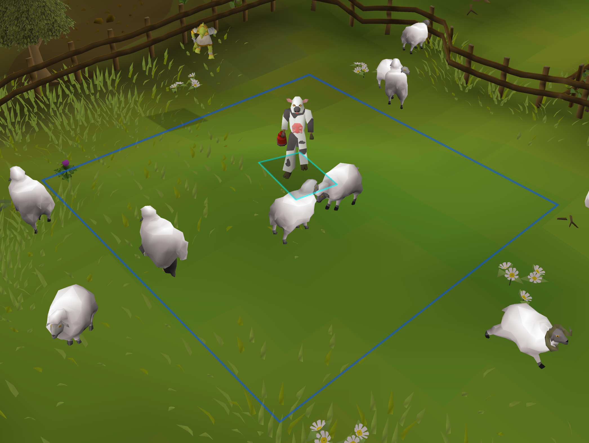

# Soulflame Range Plugin

Soulflame Range Plugin is a RuneLite plugin for Old School RuneScape that shows the range of your Soulflame horn when equipped. It displays a colored square outline around your character indicating the horn's range, and a text panel showing the range in tiles. It automatically detects your horn's configured range (0–3 tiles). You can also see other players' range squares when they have the horn equipped, which helps in group activities or PvP. The plugin is customizable: you can change the colors of your range square and other players' range squares, and toggle the visual square and text panel independently. Once installed, it works automatically when you equip the horn—no setup required.

